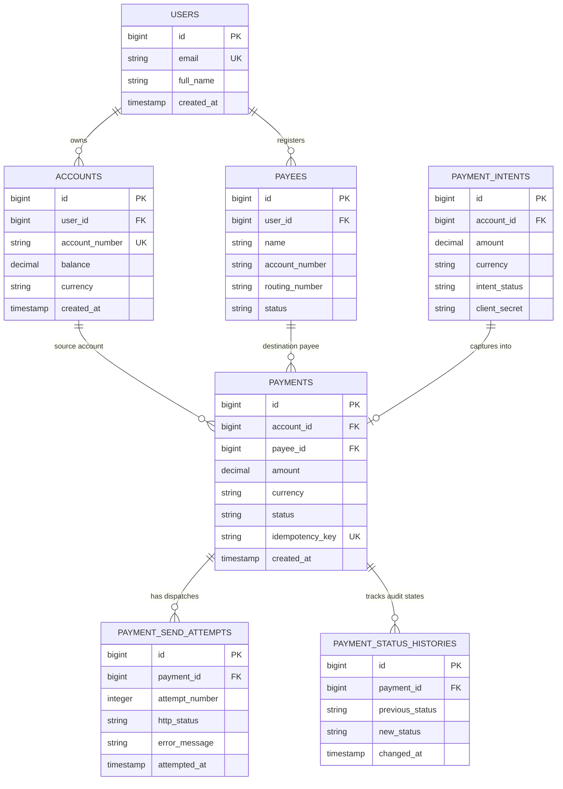
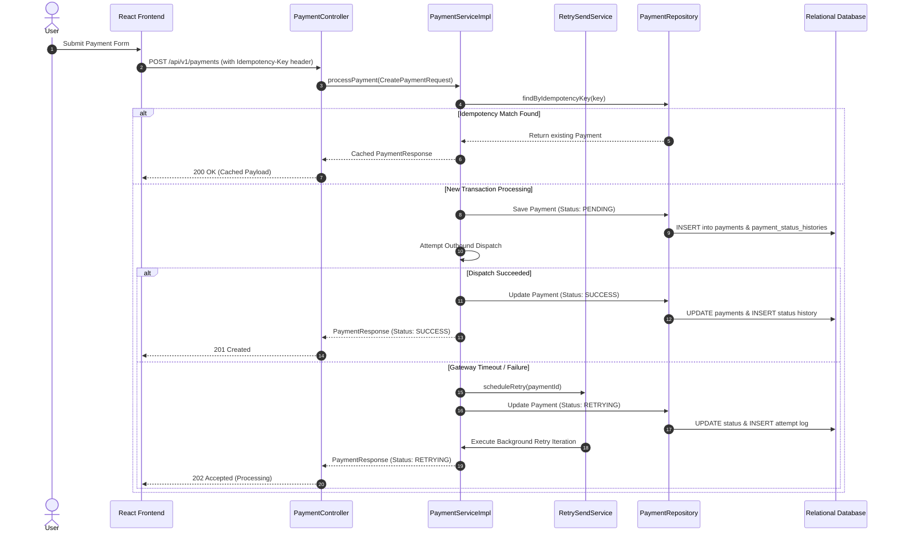

# 106-Syntax_Squad — Payment Processing Application

> A robust, enterprise-grade full-stack payment processing engine built for high-reliability financial transactions, transactional idempotency, failure retries, and comprehensive auditability.


---

## Table of Contents

- [1. Project Title](#1-project-title)
- [2. Project Description](#2-project-description)
- [3. Key Features](#3-key-features)
- [4. System Architecture](#4-system-architecture)
- [5. Backend Architecture](#5-backend-architecture)
- [6. Frontend Architecture](#6-frontend-architecture)
- [7. Database Design](#7-database-design)
- [8. Payment Flow](#8-payment-flow)
- [9. API Documentation](#9-api-documentation)
- [10. Testing](#10-testing)
- [11. Setup Instructions](#11-setup-instructions)
- [12. Environment Variables](#12-environment-variables)
- [13. Running the Application](#13-running-the-application)
- [14. Future Improvements](#14-future-improvements)
- [15. Contribution Guidelines](#15-contribution-guidelines)
- [16. License](#16-license)

---

## 1. Project Title

**106-Syntax_Squad — Payment Processing Application**

An end-to-end payment processing application engineered using **Spring Boot**, **React + Vite**, and **Relational SQL Database with Flyway migrations**. Built with resilience patterns including double-spend prevention via unique idempotency keys, failure retry loops, and complete payment state tracking.

---

## 2. Project Description

### Problem Statement
In modern fintech ecosystems, transaction systems must execute financial transfers without duplicate charges, lost events, or unhandled gateway timeouts. Traditional basic payment forms lack transactional idempotency, structured retry policies, transparent state history tracking, and strict payee validation.

### System Role
A **Payment Processing System** serves as the central orchestration engine between accounts, end users, payees, and financial distribution channels. It securely ingests transaction payloads, validates business constraints, handles funds reservation and release, tracks status progressions, and manages edge cases like network dropouts or downstream bank rejections.

### Core Capabilities
- **Resilient Execution:** Guaranteed single execution per request payload using client-supplied idempotency keys.
- **Intent-Based Orchestration:** Separation of payment reservation (Payment Intent) from final capture/settlement (Payment Execution).
- **Failure Recovery:** Automated exponential/linear retry mechanisms tracking distinct attempt records per payment dispatch.
- **Audit Compliance:** Immutable status history ledger recording state transitions with timestamped context.
- **Extensible Schema Migration:** Version-controlled Flyway migrations ensuring database schema consistency across environments.

### Target Audience
- **Fintech Engineers & Architects:** Reviewing layered Spring Boot practices, transactional boundaries, and API designs.
- **Recruiters & Technical Evaluators:** Assessing codebase quality, testing depth, architectural clarity, and domain mastery.
- **Open-Source Contributors:** Extending payment integrations, webhooks, or front-end dashboard capabilities.

---

## 3. Key Features

### Payment Management
- **Payment Creation:** Initiate direct payments between linked user accounts and validated payees with specified currency and amounts.
- **Lifecycle Tracking:** Monitor payments through states: `PENDING`, `PROCESSING`, `SUCCESS`, `FAILED`, `CANCELLED`, and `RETRYING`.
- **Payment History:** Searchable and filterable payment transaction records with pagination support.
- **Status Management:** State machine transitions enforced at the service layer preventing invalid state updates (e.g., cannot transition a `SUCCESS` payment to `CANCELLED`).

### Payment Intent Management
- **Intent Creation:** Reserve funds or register intent prior to user authentication/confirmation.
- **Execution from Intent:** Process final payment capture directly linked to an existing intent token.
- **Intent Status Tracking:** States including `REQUIRES_PAYMENT_METHOD`, `REQUIRES_CONFIRMATION`, `PROCESSING`, `SUCCEEDED`, and `EXPIRED`.

### Payee Management
- **Payee Onboarding:** Create and catalog external payees with routing numbers, account descriptors, and bank details.
- **Validation Engine:** Strict field validation on payee registration ensuring valid routing formats, account ownership, and status checks before allowing outbound dispatches.

### Account Management
- **Account Handling:** Multi-currency balance management and account status monitoring.
- **User Association:** Strict entity association mapping accounts to authenticated user profiles (`User` $\rightarrow$ `Account`).

### Reliability & Resilience Features
- **Idempotency Handling:** Request deduplication utilizing unique headers (`Idempotency-Key`). Re-submitted requests return original cached responses without duplicate side effects.
- **Retry Mechanism:** Configurable automatic retry service (`RetrySendService`) for failed attempts due to transient network failures.
- **Payment Send Attempt Tracking:** Granular entity (`PaymentSendAttempt`) capturing every HTTP/gateway attempt, HTTP status, payload, and response code.
- **Audit Trail (Status History):** Every state change emits a `PaymentStatusHistory` record storing `previous_status`, `new_status`, and `changed_at` timestamps.

### Error Handling & Standardized Responses
- **Custom Exceptions:** Domain-specific exceptions (`ResourceNotFoundException`, `PaymentProcessingException`, `IdempotencyException`, `InvalidPaymentStateException`).
- **Global Exception Handler:** Centralized `@ControllerAdvice` mapping exceptions into standard RFC-7807 compliant JSON error responses:

```json
{
  "timestamp": "2026-08-06T04:53:48Z",
  "status": 400,
  "error": "Bad Request",
  "message": "Invalid payment transition from SUCCESS to CANCELLED",
  "path": "/api/v1/payments/pay_982314/cancel"
}
```

---

## 4. System Architecture

### High-Level Architecture Overview

The system follows a classic **Layered Domain-Driven Architecture (N-Tier)** separating presentation, control, business domain logic, data mapping, and relational storage.

```mermaid
graph TD
    Client[React + Vite Frontend Dashboard]
    
    subgraph Spring Boot Backend Application
        Controller[REST Controller Layer<br/>OpenAPI / DTO Validation]
        Security[Security Layer<br/>CurrentUserService Context]
        DTO[DTO / Mapper Layer<br/>Request & Response Converters]
        Service[Service Layer<br/>PaymentService &#124; PaymentIntentService &#124; RetrySendService]
        Repo[Repository Layer<br/>Spring Data JPA Repositories]
        Entity[Entity Layer<br/>JPA Domain Entities]
    end

    DB[(Relational Database<br/>Flyway Schema Migration)]

    Client -->|HTTP / JSON REST API| Controller
    Controller --> Security
    Controller --> DTO
    Controller --> Service
    Service --> Repo
    Repo --> Entity
    Repo -->|JDBC / Hibernate| DB
```



### Layer Responsibilities

| Layer | Responsibility |
| :--- | :--- |
| **Controller Layer** | Exposes REST endpoints, parses HTTP parameters, validates incoming Request DTOs, and handles HTTP response entity wrappers. |
| **DTO Layer** | Decouples public API contracts from persistent database schemas. Prevents over-posting and leakage of internal database structures. |
| **Service Layer** | Houses core business rules, transactional boundaries (`@Transactional`), payment lifecycle state changes, idempotency enforcement, and retry logic. |
| **Repository Layer** | Interfaces with relational storage using Spring Data JPA method abstractions and custom JPQL/native queries. |
| **Entity Layer** | Maps database tables into Java domain models using JPA annotations (`@Entity`, `@Table`, `@ManyToOne`, `@OneToMany`). |

---

## 5. Backend Architecture

### Package Structure (`com.example.payments`)

```
backend/src/main/java/com/example/payments/
├── config/
│   ├── OpenAPIConfig.java             # Swagger 3.0 specification details
│   └── WebConfig.java                 # CORS mapping & web interceptors
├── controller/
│   ├── AccountController.java         # Account lookup and balance management
│   ├── PayeeController.java           # Payee CRUD operations
│   ├── PaymentController.java         # Core payment processing endpoints
│   └── PaymentIntentController.java   # Intent creation & capture endpoints
├── dto/
│   ├── request/                       # Inbound request payloads
│   │   ├── CreatePaymentRequest.java
│   │   ├── PaymentIntentRequest.java
│   │   └── PayeeRequest.java
│   └── response/                      # Outbound response payloads
│       ├── PaymentResponse.java
│       ├── AccountResponse.java
│       └── ErrorResponse.java
├── exception/
│   ├── CustomException.java           # Base domain runtime exception
│   ├── ResourceNotFoundException.java # 404 handler
│   ├── PaymentValidationException.java# 422 handler
│   └── GlobalExceptionHandler.java    # @ControllerAdvice error mapper
├── mapper/
│   └── PaymentMapper.java             # Manual/MapStruct entity-DTO mappings
├── model/entity/
│   ├── User.java                      # System user account holder
│   ├── Account.java                   # User financial account & currency balance
│   ├── Payee.java                     # Registered transfer recipient
│   ├── Payment.java                   # Core payment transaction entity
│   ├── PaymentIntent.java             # Pre-authorization payment intent
│   ├── PaymentSendAttempt.java        # Dispatch attempt log entry
│   └── PaymentStatusHistory.java      # Immutable audit state transition record
├── repository/
│   ├── UserRepository.java
│   ├── AccountRepository.java
│   ├── PayeeRepository.java
│   ├── PaymentRepository.java
│   ├── PaymentIntentRepository.java
│   ├── PaymentSendAttemptRepository.java
│   └── PaymentStatusHistoryRepository.java
├── security/
│   └── CurrentUserService.java        # Resolves user context for active session
└── service/
    ├── PaymentService.java            # Payment contract interface
    ├── PaymentServiceImpl.java        # Payment business logic & state engine
    ├── PaymentIntentService.java      # Payment intent workflow engine
    ├── PayeeService.java              # Payee registration & validation
    ├── RetrySendService.java          # Automatic failure retry background logic
    └── CurrencyConversionService.java # FX rate conversion calculation logic
```

---

## 6. Frontend Architecture

### React + Vite Application Structure

The front end is built using **React 18** and **Vite** for rapid bundling and fast HMR (Hot Module Replacement).

```
frontend/src/
├── assets/            # Static media, icons, and theme files
├── components/        # Reusable UI component building blocks
│   ├── PaymentTable.jsx   # Data grid display for transaction lists
│   ├── Sidebar.jsx        # Primary application navigation drawer
│   ├── StatusBadge.jsx    # Color-coded transaction status indicator
│   └── Timeline.jsx       # Vertical timeline for PaymentStatusHistory
├── pages/             # Route-level page view components
│   ├── CreatePaymentPage.jsx  # Form for initializing direct payment
│   ├── PayeesPage.jsx         # Payee management dashboard
│   ├── PayFromIntentPage.jsx  # Intent capture page
│   ├── PaymentDetailPage.jsx  # Audit timeline & attempt details for a payment
│   ├── PaymentsListPage.jsx   # Master transaction history table with filters
│   └── ProfilePage.jsx        # Account details & linked balance page
├── services/
│   └── api.js         # Axios instance, interceptors, base URL & error parsing
├── utils/
│   └── currency.js    # Currency formatting, symbol resolution, and formatting helpers
├── App.jsx            # Main route definition and layout template
└── main.jsx           # Application entry point
```

### Key Services & Utility Modules
- **`services/api.js`:** Single HTTP client abstraction configuring base API paths (`/api/v1`), adding standard headers (including `Idempotency-Key` generation), and normalizing API response data and exception messages.
- **`utils/currency.js`:** Helper utilities providing ISO-4217 compliant formatting (e.g., `$1,250.00 USD`, `€450.50 EUR`), decimal precision rounding, and unit conversions.

---

## 7. Database Design

### Schema Management with Flyway

Database updates are managed declaratively using **Flyway database migrations** located in `backend/src/main/resources/db/migration/`.

1. **`V1__create_tables.sql`**
   - Initializes core entity tables: `users`, `accounts`, `payees`, `payments`, `payment_intents`.
   - Creates foreign key constraints and baseline indexes.
2. **`V2__phase2_auth_idempotency_retries_payees.sql`**
   - Adds idempotency tracking columns (`idempotency_key`, `response_payload`) to `payments`.
   - Creates `payment_send_attempts` and `payment_status_histories` audit tables.
   - Enhances `payees` with verification status columns.
3. **`V3__simulation_relax_payee_account_constraints.sql`**
   - Relaxes specific foreign key constraints to allow sandboxed mock transactions and simulated gateway dispatches during dev/testing phases.

### Entity Relationship Diagram (ERD)



---

## 8. Payment Flow

### Payment Lifecycle Progression

1. **Client Submission:** User fills out transaction details on `CreatePaymentPage.jsx`. Client attaches a unique UUID `Idempotency-Key` header.
2. **Controller Validation:** `PaymentController` receives request DTO, validating positive amount, supported currency, and present payee ID.
3. **Idempotency Inspection:** `PaymentServiceImpl` checks if the `Idempotency-Key` has been processed before. If cached, returns saved response instantly.
4. **Business Validation & Account Check:** Service verifies `Account` balance sufficiency and validates that `Payee` status is active.
5. **Entity Persistence & Initial Audit:** Payment record created with status `PENDING`. An initial record is logged into `PaymentStatusHistory`.
6. **Dispatch Attempt:** Service invokes dispatch execution (`PaymentSendAttempt` created). Status transitions to `PROCESSING`.
7. **Gateway Response / Failure Retry:**
   - On **Success**: Status transitions to `SUCCESS`. Final history entry written. Account balance updated.
   - On **Transient Failure**: `RetrySendService` catches exception, updates status to `RETRYING`, and queues background retry attempt.
8. **Finalization:** Client polls or receives final transaction completion status.

### Sequence Diagram



---

## 9. API Documentation

The backend exposes an interactive **OpenAPI 3.0 / Swagger UI** playground for testing endpoints.

- **Swagger UI Path:** `http://localhost:8080/swagger-ui.html`
- **OpenAPI JSON Spec:** `http://localhost:8080/v3/api-docs`

### API Endpoint Summary Table

| Group | Method | Endpoint | Description |
| :--- | :--- | :--- | :--- |
| **Account** | `GET` | `/api/v1/accounts` | Fetch all user accounts for active session |
| **Account** | `GET` | `/api/v1/accounts/{id}` | Fetch account details by ID |
| **Payee** | `GET` | `/api/v1/payees` | List registered payees |
| **Payee** | `POST` | `/api/v1/payees` | Onboard new payee |
| **Payment** | `POST` | `/api/v1/payments` | Process new payment (requires `Idempotency-Key`) |
| **Payment** | `GET` | `/api/v1/payments` | List payment transaction history |
| **Payment** | `GET` | `/api/v1/payments/{id}` | Fetch detailed payment metadata & audit history |
| **Payment Intent**| `POST` | `/api/v1/payment-intents` | Create pre-authorized payment intent |
| **Payment Intent**| `POST` | `/api/v1/payment-intents/{id}/confirm` | Confirm & process capture from intent |

---

## 10. Testing

### Testing Strategy

The project employs a multi-tiered unit and integration testing strategy utilizing **JUnit 5**, **Mockito**, and **Spring Boot Test Framework (`@WebMvcTest`, `@SpringBootTest`)**.

```
backend/src/test/java/com/example/payments/
├── controller/
│   ├── AccountControllerTest.java        # MockMVC tests for Account REST API endpoints
│   ├── PayeeControllerTest.java          # MockMVC tests for Payee endpoints
│   ├── PaymentControllerTest.java        # MockMVC tests for Payment endpoint validation & headers
│   └── PaymentIntentControllerTest.java  # MockMVC tests for Intent workflows
├── security/
│   └── CurrentUserServiceTest.java       # Unit tests for security context resolution
└── service/
    └── PaymentServiceImplTest.java       # Core unit tests for idempotency & state transitions
```

### Executing Tests

To execute the test suite via Maven:

```bash
cd backend
mvn test
```

### Significance of Unit Testing in Financial Systems
In payment engineering, rigorous unit testing guarantees:
1. **State Machine Verification:** Ensures invalid status transitions fail predictably before mutating database records.
2. **Idempotency Guarantees:** Validates that duplicate requests never execute secondary fund deductions.
3. **Contract Adherence:** Ensures API DTO mappings adhere strictly to front-end expected payloads.

---

## 11. Setup Instructions

### Prerequisites
Ensure your local environment meets the following software requirements:

- **Java Development Kit (JDK):** Version 17 or higher (`java -version`)
- **Apache Maven:** Version 3.8+ (`mvn -version`)
- **Node.js:** Version 18.x or 20.x LTS (`node -v`)
- **npm:** Version 9.x+ (`npm -v`)
- **Relational Database:** PostgreSQL, MySQL, or built-in H2 (for local dev)

---

### Backend Setup

1. **Navigate to the backend directory:**
   ```bash
   cd backend
   ```

2. **Configure local properties:**
   Optionally edit `src/main/resources/application.yml` or copy `application-example.yml` to set custom database credentials.

3. **Build the project & run migrations:**
   ```bash
   mvn clean install
   ```

4. **Start the Spring Boot server:**
   ```bash
   mvn spring-boot:run
   ```
   The backend service will boot up on `http://localhost:8080`.

---

### Frontend Setup

1. **Navigate to the frontend directory:**
   ```bash
   cd frontend
   ```

2. **Install node dependencies:**
   ```bash
   npm install
   ```

3. **Start the Vite development server:**
   ```bash
   npm run dev
   ```
   The application dashboard will be accessible at `http://localhost:5173`.

---

## 12. Environment Variables

Configure application parameters using environment variables or `application.yml`:

| Variable | Description | Default Value | Sample / Production Value |
| :--- | :--- | :--- | :--- |
| `SPRING_DATASOURCE_URL` | JDBC Connection String | `jdbc:h2:mem:paymentdb` | `jdbc:postgresql://localhost:5432/paymentdb` |
| `SPRING_DATASOURCE_USERNAME` | Database User | `sa` | `payment_app_user` |
| `SPRING_DATASOURCE_PASSWORD` | Database Password | `""` | `SuperSecr3tPass!123` |
| `SERVER_PORT` | Spring Boot HTTP Port | `8080` | `8080` |
| `FLYWAY_ENABLED` | Enable Flyway Migrations | `true` | `true` |
| `CORS_ALLOWED_ORIGINS` | Permitted Client Origins | `http://localhost:5173` | `https://payments.yourdomain.com` |

---

## 13. Running the Application

Once both backend and frontend servers are launched:

1. **Access Web Application:** Open `http://localhost:5173` in any modern web browser.
2. **Access Swagger API Docs:** Navigate to `http://localhost:8080/swagger-ui.html` to explore interactive backend REST endpoints.
3. **Verify Database Setup:** Check Flyway migration logs in terminal output to confirm `V1`, `V2`, and `V3` executed cleanly.

---

## 14. Future Improvements

While feature-complete for core payment processing capabilities, the following enhancements represent realistic production-grade additions:

- [ ] **Enterprise Security:** Integrate OAuth2 / JWT (JSON Web Tokens) with Role-Based Access Control (RBAC) via Spring Security.
- [ ] **Live Gateway Integration:** Add Stripe / Plaid / Adyen SDK integration for real-world card clearing and ACH transfers.
- [ ] **Event-Driven Architecture:** Introduce Apache Kafka / RabbitMQ for async payment status publishing and webhook dispatching.
- [ ] **Distributed Tracing & Metrics:** Add Spring Boot Actuator, Prometheus, Grafana dashboards, and OpenTelemetry tracing.
- [ ] **Containerization & K8s:** Package services into multi-stage Dockerfiles and Helm charts for Kubernetes deployments.

---

## 15. Contribution Guidelines

Contributions are welcome! Follow these steps to contribute:

1. **Fork the Repository:** Click the "Fork" button on top of the repository.
2. **Create a Feature Branch:**
   ```bash
   git checkout -b feature/amazing-feature
   ```
3. **Commit your changes:** Follow standard Conventional Commits formatting:
   ```bash
   git commit -m "feat(payment): add retry interval backoff configuration"
   ```
4. **Push to the Branch:**
   ```bash
   git push origin feature/amazing-feature
   ```
5. **Open a Pull Request:** Submit your PR against the `main` branch with detailed descriptions of changes and test proof.

---

## 16. License

This project is licensed under the **MIT License**. See the `LICENSE` file for details.

---

<p align="center">
  Crafted with care by <b>106-Syntax_Squad</b>
</p>
